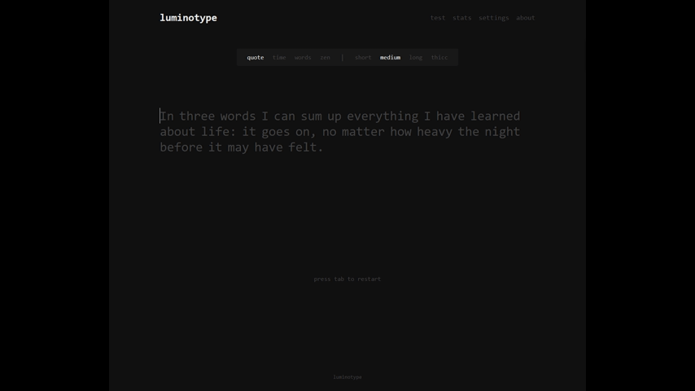

# Luminotype

A fast, minimalist typing test web app. Pick a mode, start typing, and your speed (wpm), accuracy,
raw speed, and consistency are measured in real time. Results and settings are stored locally in
your browser — no account required.



Modes: `quote`, `time`, `words`, and `zen` (free typing). Press **Tab** to restart, **Enter** to
finish a zen run.

## Quick start

Requires Node.js >= 20, pnpm 10 (`corepack enable`), and Docker.

```bash
pnpm install

# 1. Start PostgreSQL, apply migrations, seed the corpus
docker compose up -d db
pnpm db:migrate
pnpm seed

# 2. Run web (http://localhost:5173) + api (http://localhost:3001)
pnpm dev
```

Or run the whole stack in containers:

```bash
cp .env.example .env       # adjust credentials/ports if desired
docker compose up --build  # then open http://localhost:8080
```

Prebuilt images are published to GHCR on every push to `main` — see
[Deployment](./docs/wiki/deployment.md).

## Documentation

Full technical documentation lives in the [`docs/wiki`](./docs/wiki/README.md):

| Document                                      | What it covers                                              |
| --------------------------------------------- | ----------------------------------------------------------- |
| [Architecture](./docs/wiki/architecture.md)   | System design, monorepo layout, and request/data flow       |
| [Typing Engine](./docs/wiki/typing-engine.md) | The performance-critical input loop, state machine, stats   |
| [Frontend](./docs/wiki/frontend.md)           | React structure, theming, state stores, scrolling word view |
| [API Reference](./docs/wiki/api.md)           | HTTP endpoints, request/response shapes, error behavior     |
| [Database](./docs/wiki/database.md)           | Schema, migrations, and the seeding pipeline                |
| [Development](./docs/wiki/development.md)     | Local setup, workspace scripts, and testing                 |
| [Deployment](./docs/wiki/deployment.md)       | Docker Compose topology, GHCR images, production build      |

## License

See [LICENSE](./LICENSE).
